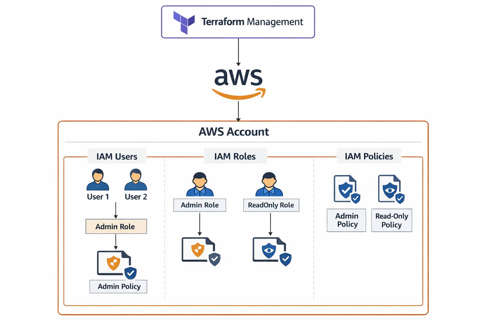

# Project 2 – IAM & Security

This Terraform project demonstrates creating AWS IAM users and roles with least-privilege policies.

## Features
- Create IAM user: gerald_user
- Attach AWS managed policy: ReadOnlyAccess
- Create IAM role: gerald_role
- Attach custom least-privilege policy
- Output the user and role names

## Architecture Diagram




## Requirements
- AWS CLI configured
- Terraform installed

## How to run
terraform init
terraform plan -var "username=gerald_user"
terraform apply -var "username=gerald_user"

## Mock Apply / Plan Output

The following Terraform plan demonstrates the IAM infrastructure that would be created:

```bash
cat plan_output.txt


## Outputs
- IAM user name
- IAM role name

## Mock Apply / Plan Output
cat plan_output.txt

# IAM Role
resource "aws_iam_role" "gerald_role" {
  name = "gerald_role"
  assume_role_policy = jsonencode({
    Version = "2012-10-17"
    Statement = [{
      Action = "sts:AssumeRole"
      Effect = "Allow"
      Principal = {
        Service = "ec2.amazonaws.com"
      }
    }]
  })
}

resource "aws_iam_role_policy_attachment" "role_readonly" {
  role       = aws_iam_role.gerald_role.name
  policy_arn = "arn:aws:iam::aws:policy/ReadOnlyAccess"
}

# IAM User
resource "aws_iam_user" "gerald_user" {
  name = "gerald_user"
}

resource "aws_iam_user_policy_attachment" "user_readonly" {
  user       = aws_iam_user.gerald_user.name
  policy_arn = "arn:aws:iam::aws:policy/ReadOnlyAccess"
}
